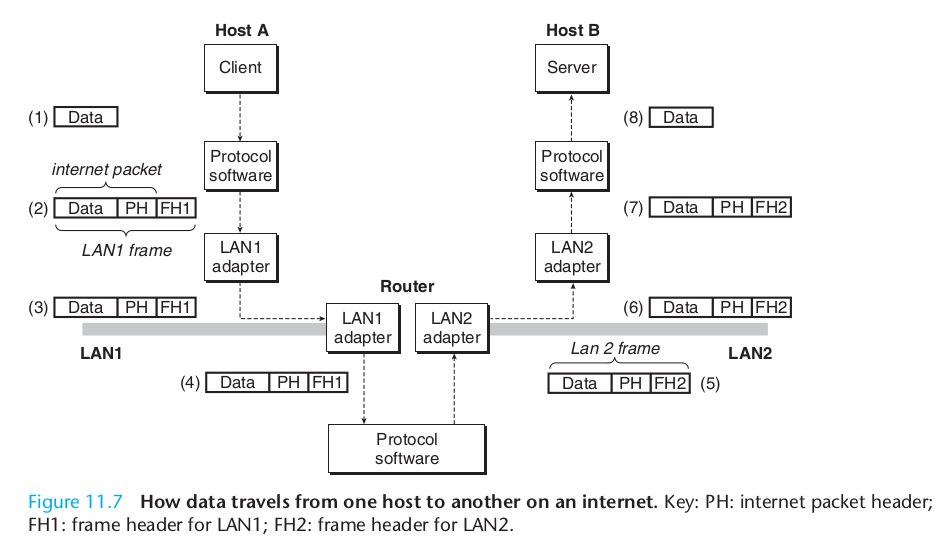
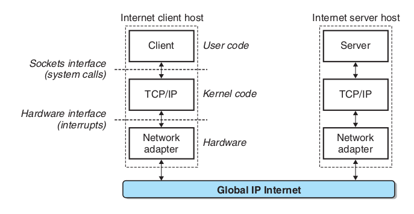
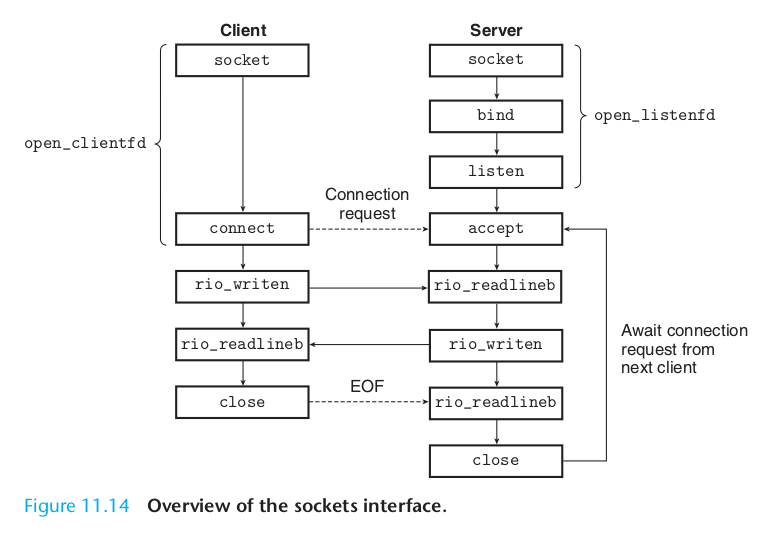

##Chapter 11 Network Programming

###11.1 The Client-Server Programming Model
Every network application is based on the client-server model. With this model, an application consists of a server process and one or more client processes. A server manages some resource, and it provides some service for its clients by manipulating that resource. For example, a Web server manages a set of disk files that it retrieves and executes on behalf of clients. An FTP server manages a set of disk files that it stores and retrieves for clients.

### 11.2 Networks
Data received from the network is copied from the adapter across the I/O and memory buses into memory, typically by a DMA transfer. Similarly, data can also be copied from memory to the network.

The crucial property of an internet is that it can consist of different LANs and WANs with radically different and incompatible technologies. Each host is physically connected to every other host, but how is it possible for some source host to send data bits to another destination host across all of these incompatible networks?
The solution is a layer of protocol software running on each host and router that smoothes out the differences between the different networks. This software implements a protocol that governs how hosts and routers cooperate in order to transfer data. The protocol must provide two basic capabilities:

- Naming scheme. Different LAN technologies have different and incompatible ways of assigning addresses to hosts. The internet protocol smoothes these differences by defining a uniform format for host addresses. Each host is then assigned at least one of these internet addresses that uniquely identifies it.
- Delivery mechanism. Different networking technologies have different and incompatible ways of encoding bits on wires and of packaging these bits into frames. The internet protocol smoothes these differences by defining a uniform way to bundle up data bits into discrete chunks called packets. A packet consists of a header, which contains the packet size and addresses of the source and destination hosts, and a payload, which contains data bits sent from the source host.



### 11.3 Global IP Internet

 
From a programmer’s perspective, we can think of the Internet as a worldwide collection of hosts with the following properties:

- The set of hosts is mapped to a set of 32-bit IP addresses.
- The set of IP addresses is mapped to a set of identifiers called Internet domain names.
- A process on one Internet host can communicate with a process on any other Internet host over a connection.

#### 11.3.1 IP Address
Because Internet hosts can have different host byte orders, TCP/IP defines a uniform network byte order (big-endian byte order) for any integer data item, such as an IP address, that is carried across the network in a packet header.

#### 11.3.2 Internet Domain Names

#### 11.3.3 Internet Connection

Internet clients and servers communicate by sending and receiving streams of bytes over connections. A connection is point-to-point in the sense that it connects a pair of processes. It is full-duplex in the sense that data can flow in both directions at the same time. And it is reliable in the sense that—barring some catastrophic failure such as a cable cut by the proverbial careless backhoe operator—the stream of bytes sent by the source process is eventually received by the destination process in the same order it was sent.


###11.4 The Sockets Interface


####11.4.1 Socket Address Structures
From the perspective of the Unix kernel, a socket is an end point for communication. From the perspective of a Unix program, a socket is an open file with a corresponding descriptor.

```c
/* Generic socket address structure (for connect, bind, and accept) */
struct sockaddr {
    unsigned short sa_family;/* Protocol family */
    char sa_data[14]; /* Address data. */
};
/* Internet-style socket address structure */
struct sockaddr_in {
    unsigned short sin_family;
    unsigned short sin_port; // 2 bytes
    struct in_addr sin_addr; // 4 bytes
    unsigned char sin_zero[8]; //padding
};
```

####11.4.2 The socket Function
The clientfd descriptor returned by socket is only partially opened and cannot yet be used for reading and writing.

####11.4.5 The bind Function
The bind function tells the kernel to associate the server’s socket address in my_addr with the socket descriptor sockfd.

####11.4.6 The listen Function
By default, the kernel assumes that a descriptor created by the socket function corresponds to an active socket that will live on the client end of a connection. A server calls the listen function to tell the kernel that the descriptor will be used by a server instead of a client.

#### 11.4.8 The accept Function
The accept function waits for a connection request from a client to arrive on the listening descriptor listenfd, then fills in the client’s socket address in addr, and returns a connected descriptor that can be used to communicate with the client using Unix I/O functions.


What does EOF on a connection mean? The idea of EOF is often confusing to students, especially in the context of Internet connections. First, we need to understand that there is no such thing as an EOF character. Rather, EOF is a condition that is detected by the kernel. An application finds out about the EOF condition when it receives a zero return code from the read function. For disk files, EOF occurs when the current file position exceeds the file length. For Internet connections, EOF occurs when a process closes its end of the connection. The process at the other end of the connection detects the EOF when it attempts to read past the last byte in the stream.

###11.5 Web Servers
####11.5.2 Web Content
To Web clients and servers, content is a sequence of bytes with an associated MIME (Multipurpose Internet Mail Extensions) type

Web servers provide content to clients in two different ways:

- Fetch a disk file and return its contents to the client. The disk file is known as static content and the process of returning the file to the client is known as serving static content.
- Run an executable file and return its output to the client. The output produced by the executable at run time is known as dynamic content, and the process of running the program and returning its output to the client is known as serving dynamic content.

There are several points to understand about how servers interpret the suffix of a URL:
- There are no standard rules for determining whether a URL refers to static or dynamic content. Each server has its own rules for the files it manages. A common approach is to identify a set of directories, such as cgi-bin, where all executables must reside.
- The initial ‘/’ in the suffix does not denote the Unix root directory. Rather, it denotes the home directory for whatever kind of content is being requested. For example, a server might be configured so that all static content is stored in directory /usr/httpd/html and all dynamic content is stored in directory /usr/httpd/cgi-bin.
- The minimal URL suffix is the ‘/’ character, which all servers expand to some default home page such as /index.html. This explains why it is possible to fetch the home page of a site by simply typing a domain name into the browser. The browser appends the missing ‘/’ to the URL and passes it to the server, which expands the ‘/’ to some default file name.

####11.5.3 HTTP Transactions
##### HTTP Requests
```
<method> <uri> <version>
<header name>: <header data>
```
The Host header is used by proxy caches, which sometimes serve as intermediaries betweena browser and the origin server that manages the requested file. Multiple proxiescan exist between a client and an origin server in a so-called proxy chain. The datain the Host header, which identifies the domain name of the origin server, allows aproxy in the middle of a proxy chain to determine if it might have a locally cachedcopy of the requested content.

##### HTTP Response
```
<version> <status code> <status message>
response headers

response body
```

#### 11.5.4 Serving Dynamic Content
How does the client pass anyprogram arguments to the server? How does the server pass these argumentsto the child process that it creates? How does the server pass other informationto the child that it might need to generate the content? Where does the childsend its output? These questions are addressed by a de facto standard called CGI(Common Gateway Interface).

#####How Does the Server Pass Arguments to the Child?
After a server receives a request such as
```
GET /cgi-bin/adder?15000&213 HTTP/1.1
```
it calls fork to create a child process and calls execve to run the /cgi-bin/adderprogram in the context of the child. Programs like the adder program are oftenreferred to as CGI programs because they obey the rules of the CGI standard.And since many CGI programs are written as Perl scripts, CGI programs areoften called CGI scripts. Before the call to execve, the child process sets theCGI environment variable QUERY_STRING to “15000&213”, which the adderprogram can reference at run time using the Unix getenv function.

#####Where Does the Child Send Its Output?
A CGI program sends its dynamic content to the standard output. Before thechild process loads and runs the CGI program, it uses the Unix dup2 functionto redirect standard output to the connected descriptor that is associated withthe client. Thus, anything that the CGI program writes to standard output goesdirectly to the client.
Notice that since the parent does not know the type or size of the content thatthe child generates, the child is responsible for generating the Content-type andContent-length response headers, as well as the empty line that terminates theheaders.

For POST requests, the child would also need to redirect standard input to the connected descriptor. The CGI program would then read the arguments in the request body from standard input.

### 11.6 The TINY Web Server

##More: [tcp-ip-illustrated-volume-1](tcp_ip_illustrated.md)
